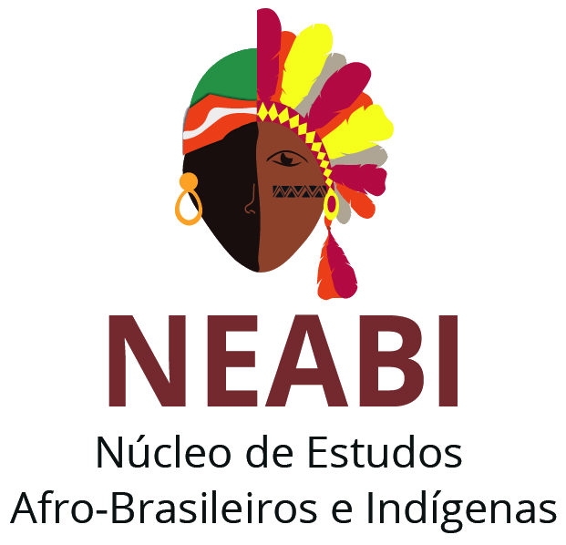
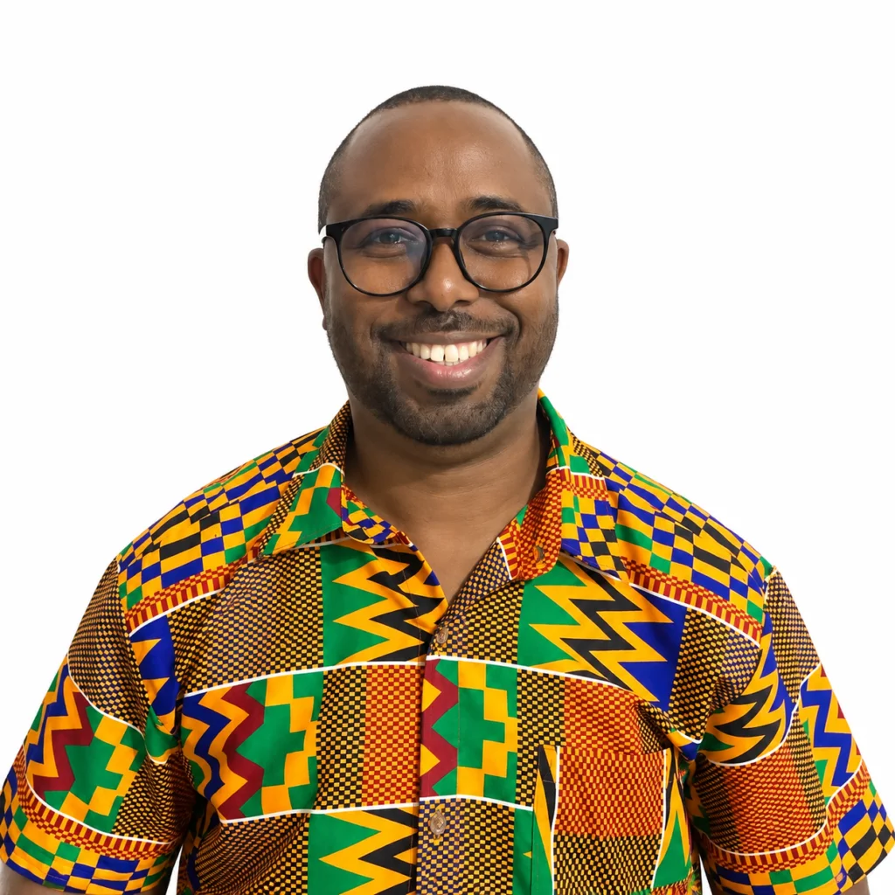
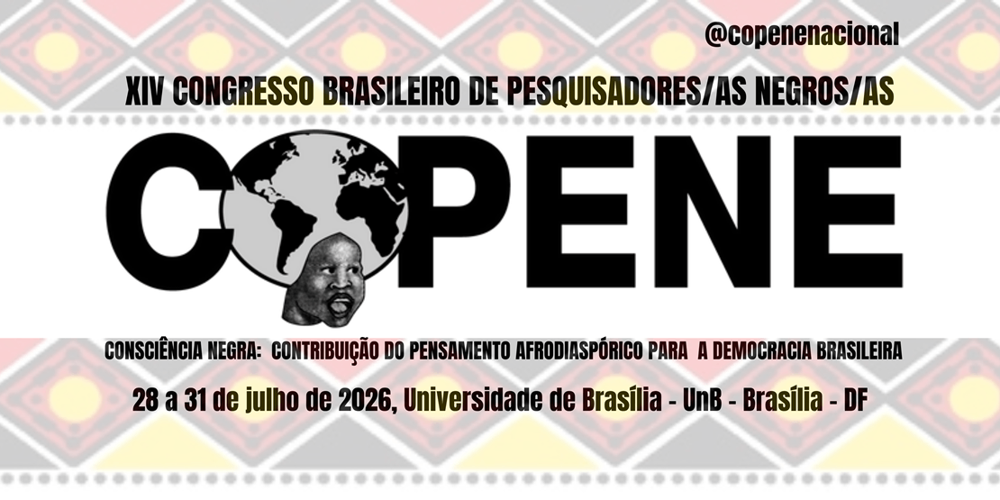

<!DOCTYPE html>
<html lang="en">

<head>
    <meta charset="UTF-8">
    <meta name="viewport" content="width=device-width, initial-scale=1.0">
    <title>Document</title>
    <link rel="stylesheet" href="Estilo.css">
</head>

<body>
    <nav>
        <a href="#nossa-historia">Nossa História</a>
        <a href="#gaspar">Em Gaspar</a>
        <a href="#Herculano">Coordenador</a>
        <a href="#oportunidades">Oportunidades</a>
        <a href="#atividades">Ações</a>
    </nav>

    <header>
        

            <h1></h1>
        

    </header>

    

    

        <h1 id="nossa-historia">Nossa Historia</h1>

        

            

                O NEABI (Núcleo de Estudos Afro-Brasileiros e Indígenas) é um órgão presente em escolas, institutos federais e universidades,
                voltado ao desenvolvimento de atividades de ensino, pesquisa e extensão, com o objetivo de valorizar,
                compartilhar e promover conhecimentos sobre as culturas afro-brasileira e indigena.
                Atualmente, os NEABIs estão
                presentes em diversas instituições de ensino pelo Brasil,
                atuando em conjunto com outras organizações,
                como a ABPN (Associação Brasileira de Pesquisadores Negros) e o CONNEABs
                (Consórcio Nacional de Núcleos de Estudos Afro-Brasileiros, NEABIs e Grupos Correlatos),
                que contribuem para a articulação de iniciativas e o fortalecimento das discussões sobre as relações étnico-raciais.
            

            
        

        <h2 id="gaspar">QUANDO O NEABI COMEÇOU A ATUAR EM GASPAR?</h2>
        

            O NEABI (Núcleo de Estudos Afro-Brasileiros e Indígenas) do IFSC Campus Gaspar foi criado em 2015,
            sendo o primeiro núcleo desse tipo no IFSC e servindo de referência para a criação de outros núcleos nos demais campus.

            Sua criação está relacionada à necessidade de valorizar a história, a cultura e a memória das populações afro-brasileiras e indígenas, que historicamente foram pouco representadas no ensino.

            O núcleo também está relacionado às Leis nº 10.639/2003 e nº 11.645/2008, que tornaram obrigatório o ensino da história e da cultura afro-brasileira e indígena nas escolas.
        

        
    

    

        <h1>PRINCIPAL IDEALIZADOR| COORDENADOR</h1>
        

            

                Luiz Herculano de Sousa Guilherme é doutor em Língua Portuguesa pela UFRJ, professor do IFSC – Câmpus Gaspar e assessor de Ações Afirmativas, Equidade e Inclusão da instituição. Também é coordenador nacional do Projeto Afrocientista e, na gestão 2026–2028, assumIU a Secretaria Executiva da Associação Brasileira de Pesquisadores Negros (ABPN). Foi idealizador e coordenador do NEABI do IFSC Gaspar, onde teve a iniciativa de viabilizar projetos de pesquisas, coordenando as atividades e proporcionando bolsas para que estudantes desenvolvessem pesquisas sobre questões étnico-raciais, incentivando a educação antirracista, a inclusão e a valorização da cultura afro-brasileira no instituto federal.
            

            
        

        <h1>PORQUE INICIATIVAS ASSIM SÃO IMPORTANTES?</h1>
        

            Iniciativas como a do NEABI são importantes para combater o racismo por meio de ações educativas e de conscientização, enfrentando o preconceito e as desigualdades raciais no ambiente escolar. Além disso, promovem a valorização da história, da memória, da ancestralidade e dos conhecimentos dos povos negros e indígenas, por meio de rodas de conversa, oficinas culturais e eventos acadêmicos que incentivam a reflexão sobre as relações étnico-raciais. Também contribuem para tornar o câmpus um espaço de respeito à diversidade e de acolhimento diante de situações de racismo, além de fortalecer a articulação com a comunidade por meio de parcerias com movimentos sociais e da participação em suas atividades.
        

        <section class="oportunidades">
            <h2 id="oportunidades">OPORTUNIDADES</h2>
            
O estudo das relações étnico-raciais é muito amplo, podendo abranger diversas áreas de interesse, como música, teatro, cinema e outras formas de expressão. Dessa forma, é possível explorar esses assuntos de maneira mais leve e dinâmica, pesquisando sobre suas histórias e problemáticas, mas também se divertindo, desenvolvendo a criatividade e se orgulhando dos conhecimentos adquiridos ao longo do projeto.

            
Tendo em vista isso, diversos alunos utilizaram desses conhecimentos e de seus interesses para desenvolver pesquisas e até mesmo apresentá-las em congressos por todo o país! No IFSC Gaspar, por exemplo, diversos jovens já apresentaram trabalhos no XIV Congresso Brasileiro de Pesquisadores(as) Negros(as) (COPENE), abordando temas como ações afirmativas, racismo, representatividade negra, diversidade cultural e questões étnico-raciais em diferentes áreas do conhecimento.

            
Essas oportunidades são resultado do incentivo à pesquisa e à participação dos estudantes promovidos pelo NEABI, que, sob a coordenação do professor Luiz Herculano de Sousa Guilherme, também possibilitou a participação de alunos em projetos como o Afrocientista, oferecendo bolsas para o desenvolvimento de pesquisas. Além de ampliar os conhecimentos, essas experiências permitem que os estudantes compartilhem suas descobertas, conheçam diferentes realidades e tenham contato com pesquisadores de todo o Brasil, fortalecendo sua formação acadêmica, pessoal e social.

            
Além disso, essas pesquisas também podem proporcionar a oportunidade de viajar para outros estados, como Belém, Brasília e Rio Grande do Sul, quando os estudantes são selecionados para apresentar seus trabalhos em congressos e eventos acadêmicos. Essas experiências permitem conhecer diferentes realidades, trocar conhecimentos com pesquisadores de todo o Brasil, participar de debates e entrar em contato com novas culturas. Dessa forma, os alunos ampliam seus conhecimentos, desenvolvem sua autonomia e fortalecem sua formação acadêmica e pessoal.

        </section>

        <h2 id="atividades">AÇÕES REALIZADAS PELO IFSC GASPAR</h2>
        

            
- Palestras e rodas de conversa: promove encontros sobre racismo, antirracismo, diversidade e valorização da cultura afro-brasileira e indígena.

            
- Encontro com Ernesto Xavier (2024): o jornalista e influenciador participou de rodas de conversa e de uma live sobre racismo e discurso de ódio nas redes sociais. Ele apresentou dados de sua pesquisa, indicando que cerca de 60% dos relatos de racismo analisados aconteciam no ambiente escolar.

            
- Participação em eventos científicos: Participação no copene ou diversos outros eventos cientificos.

            
- Evento Negritude em Foco: participação em atividades realizadas em Gaspar, com oficinas e apresentações sobre a cultura negra em escolas da região.

            
- Divulgação nas redes sociais: produção de vídeos e conteúdos informativos sobre questões raciais e divulgação das ações do núcleo, com experiências também em blogs e no YouTube.

        

        
para mais informações, acesse o site ou redes sociais a seguir.

        

            
            
        

    

    
</body>
</html>
